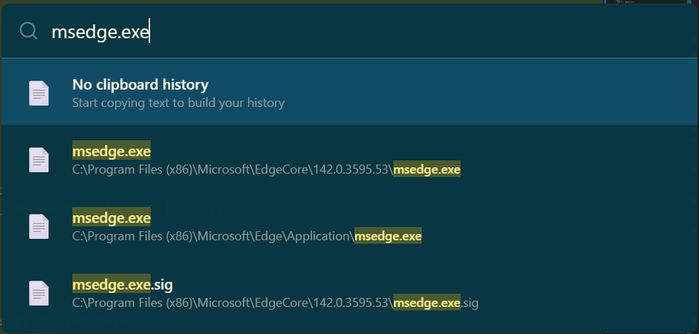
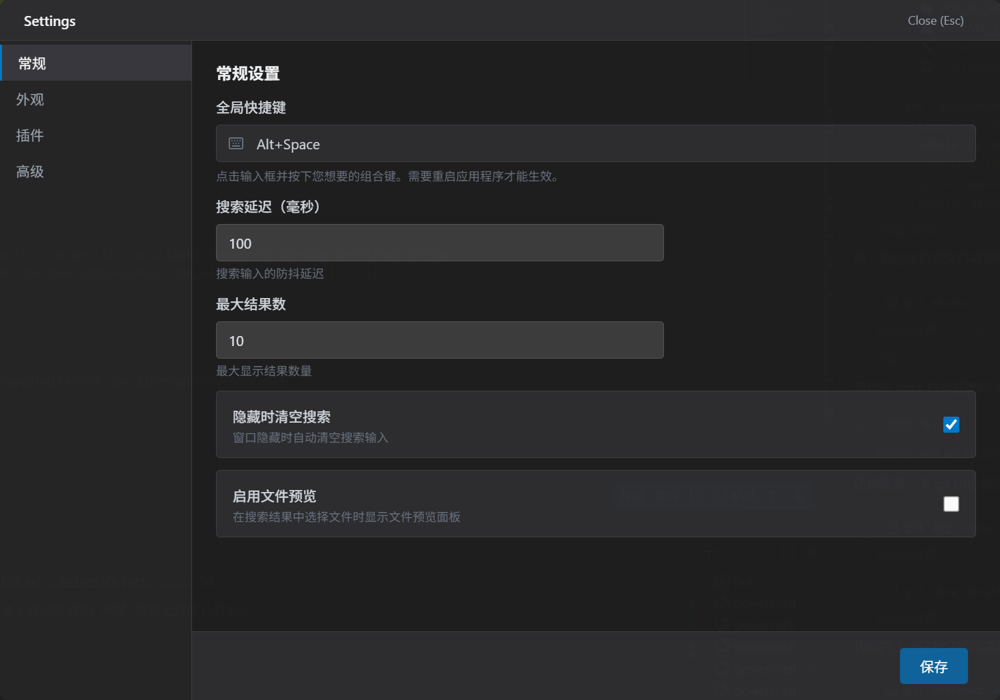

<div align="center">

# iLauncher

<p>
  <strong>快速、轻量、优雅的应用启动器</strong>
</p>

<p>
  <a href="https://github.com/dulingzhi/iLauncher/releases">
    
  </a>
  <a href="https://github.com/dulingzhi/iLauncher/blob/master/LICENSE">
    
  </a>
  <a href="https://github.com/dulingzhi/iLauncher/releases">
    
  </a>
</p>

</div>

---

## 📸 预览

### 搜索界面


### 设置界面


---

## ✨ 特性

- 🚀 **极速启动** - Rust 核心 + GPUI 原生渲染，毫秒级响应
- 🎯 **全局快捷键** - `Alt + Space` 随时唤起
- ⚡ **MFT 文件搜索** - 直读 NTFS 主文件表，百万级文件毫秒出结果
- 🧩 **插件系统** - 内置计算器/网页搜索等，支持安装 .ilp 插件包
- 🤖 **AI 助手** - 六家 provider（OpenAI/DeepSeek/GitHub 等），Markdown 渲染对话
- 📋 **剪贴板历史** - 文本/图片全记录，哈希去重
- 🔁 **工作流** - JSON 定义的自动化任务编排
- 🔄 **自动更新** - minisign 签名校验，一键静默升级
- 🎨 **深色模式** - 跟随系统，托盘一键切换

---

## 📦 下载安装

### Windows

访问 [Releases](https://github.com/dulingzhi/iLauncher/releases) 页面下载
`iLauncher_x.x.x_x64-setup.exe`，运行即装。安装目录
`%LOCALAPPDATA%\Programs\iLauncher`，卸载走系统设置或开始菜单。

> 首个基于 GPUI 的版本自动覆盖旧 Tauri 版安装，配置与剪贴板数据保留在
> `%LOCALAPPDATA%\iLauncher\` 不动。

---

## 🚀 快速开始

安装后应用自动运行，系统托盘有 iLauncher 图标。

- **显示/隐藏**: `Alt + Space`
- **选择**: `↑` / `↓`
- **执行**: `Enter`
- **隐藏窗口**: `Esc`

输入即搜：应用名、文件名、数学表达式（`2+2`）、`clipboard` 打开剪贴板历史、
`settings` 打开设置。

---

## 🛠️ 开发者

### 技术栈

纯 Rust：GPUI（gpui-kit 0.6，Zed 同款 UI 框架）+ Windows API。
无 JS/TS，无 WebView。

```
gpui-app/          启动器主体（UI + 插件框架 + AI/工作流/更新等模块）
ilauncher-index/   文件索引独立 crate（MFT v3 服务 + USN 增量，无 UI 依赖）
ilauncher-clipboard/ 剪贴板历史独立 crate（无 UI 依赖）
scripts/           打包与发版脚本（NSIS、latest.json 生成）
```

### 本地开发

```bash
# 运行（Demo 数据）
cargo run --manifest-path gpui-app/Cargo.toml

# 全功能（真实索引 + 剪贴板）
cargo run --manifest-path gpui-app/Cargo.toml --features "ilauncher clipboard"

# 单测（四种 feature 组合都应全绿）
cargo test --manifest-path gpui-app/Cargo.toml
cargo test --manifest-path gpui-app/Cargo.toml --features ilauncher
cargo test --manifest-path gpui-app/Cargo.toml --features clipboard
cargo test --manifest-path gpui-app/Cargo.toml --features "ilauncher clipboard"
```

### 打包发版

```powershell
# 需要 NSIS（choco install nsis）；-Sign 需要 minisign 与私钥
powershell -File scripts/pack-gpui.ps1 -Version 0.2.0 -Sign
node scripts/generate-updater-json.js 0.2.0 v0.2.0
```

推送 `v*` 标签走 CI 自动发版，详见 [.github/workflows/README.md](.github/workflows/README.md)。

### 文档

- [UI 迁移方案与实施进度](docs/UI_GPUI_MIGRATION_PLAN.md)
- [发布流程](.github/workflows/README.md)
- 旧版（Tauri）设计文档：[docs/archive/](docs/archive/)

---

## ❓ 常见问题

**Q: MFT 文件搜索为什么弹 UAC？**
直读 NTFS 主文件表需要管理员权限。首次启用时提权拉起索引服务（独立进程，
UI 不常驻提权）；拒绝也可使用，会降级为传统遍历（慢）。

**Q: 数据存哪里？**
`%LOCALAPPDATA%\iLauncher\`：配置 JSON、剪贴板历史 JSONL、审计日志、索引快照。

**Q: 如何卸载？**
系统设置 → 应用 → iLauncher → 卸载；或运行安装目录里的 `uninstall.exe`。

---

## 🤝 贡献

欢迎 Issue 和 Pull Request：Fork → 特性分支 → 提交 → PR。

## 📄 许可证

MIT - 详见 [LICENSE](LICENSE)。

## 🙏 致谢

- [Wox](https://github.com/Wox-launcher/Wox) - 灵感来源
- [GPUI](https://www.gpui.rs/) - UI 框架
- [Raycast](https://www.raycast.com/) - UI 设计参考

<div align="center">

**如果觉得有用，请给个 ⭐ Star！**

Made with ❤️ by [dulingzhi](https://github.com/dulingzhi)

</div>
