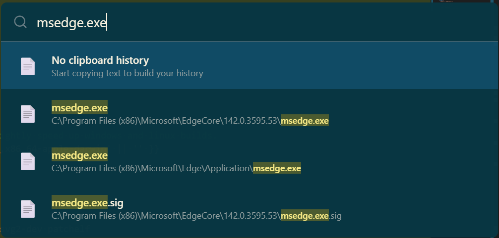

<div align="center">

# iLauncher

<p>
  <strong>Fast, Lightweight, and Elegant Application Launcher</strong>
</p>

<p>
  <a href="https://github.com/dulingzhi/iLauncher/releases">
    
  </a>
  <a href="https://github.com/dulingzhi/iLauncher/blob/master/LICENSE">
    
  </a>
  <a href="https://github.com/dulingzhi/iLauncher/releases">
    
  </a>
</p>

<p>
  <a href="../README.md">中文</a> | <strong>English</strong>
</p>

</div>

---

## 📸 Preview

### Search Interface


### Settings Interface


---

## ✨ Features

- 🚀 **Lightning Fast** - Rust core, millisecond response
- 🎯 **Global Hotkey** - Summon with `Alt + Space` anytime
- 🔍 **Smart Search** - Pinyin and fuzzy matching support
- ⚡ **MFT File Search** - 4.5M+ files scanned in 9 seconds
- 🎨 **Beautiful Themes** - Multiple built-in themes with customization
- 📋 **Clipboard History** - Never lose important content
- 🧮 **Calculator** - Quick math expression evaluation
- 🔄 **Auto Update** - One-click update to latest version
- 🔐 **Auto Start** - Optional startup with system boot
- 💾 **Lightweight** - Memory usage < 50MB
- 🌍 **Cross-platform** - Windows, macOS, Linux

---

## 📦 Download & Install

### Windows

Visit [Releases](https://github.com/dulingzhi/iLauncher/releases) page to download the latest version:

- **Recommended**: `iLauncher_x.x.x_x64-setup.exe` (Installer)
- Or: `iLauncher_x.x.x_x64.msi` (MSI Package)

### macOS

- **Intel Mac**: `iLauncher_x.x.x_x64.dmg`
- **Apple Silicon (M1/M2/M3)**: `iLauncher_x.x.x_aarch64.dmg`

### Linux

- **AppImage**: `iLauncher_x.x.x_amd64.AppImage` (Portable, run directly)
- **Debian/Ubuntu**: `iLauncher_x.x.x_amd64.deb`

---

## 🚀 Quick Start

### 1. Launch Application

After installation, the app will run automatically. You'll see the iLauncher icon in the system tray.

### 2. Keyboard Shortcuts

- **Show/Hide**: `Alt + Space` (Windows/Linux) or `Cmd + Space` (macOS)
- **Select Up**: `↑` or `Ctrl + P`
- **Select Down**: `↓` or `Ctrl + N`
- **Execute**: `Enter`
- **Hide Window**: `Esc`

### 3. Start Searching

Type anything to start searching:

- **Applications**: Enter app name to launch quickly
- **Files**: Enter filename to find files
- **Calculate**: Enter math expression (e.g., `2+2`)
- **Clipboard**: Type `clipboard` to view history
- **Settings**: Type `settings` to open preferences

---

## 🎯 Core Features

### 📱 Application Search

Quickly find and launch installed applications with Pinyin initials support.

**Examples**:
- Type `chrome` → Launch Chrome Browser
- Type `wjb` → Find "WeChat" (Pinyin initials: WeiJinBan)

### 📂 File Search

Using MFT (Master File Table) technology for millisecond-level file searching.

**Performance**:
- 4.5M+ files scan time: ~9 seconds
- Search response time: < 50ms
- Real-time index updates supported

### 🧮 Calculator

Evaluate math expressions directly in the search box.

**Examples**:
- `2+2` → `4`
- `sin(90)` → `1`
- `sqrt(16)` → `4`

### 📋 Clipboard History

Automatically records copied text, never lose important content.

**Features**:
- Automatic history saving
- Favorite frequently used content
- Quick search and paste

### 🎨 Theme System

Multiple beautiful built-in themes with custom theme editor support.

**Built-in Themes**:
- VS Code Dark
- GitHub Light
- Dracula
- Nord
- Monokai
- More...

---

## ⚙️ Settings

### General Settings

- **Global Hotkey**: Customize summon shortcut
- **Search Delay**: Adjust search debounce time
- **Max Results**: Control number of search results displayed
- **Interface Language**: Chinese/English

### Appearance Settings

- **Theme**: Select or customize themes
- **Window Size**: Adjust window width and height
- **Font Size**: Adjust interface font
- **Transparency**: Set window transparency
- **Preview Panel**: Enable/disable file preview

### Advanced Settings

- **Auto Start**: Run automatically on system startup
- **Tray Icon**: Show/hide system tray icon
- **Cache Management**: Clear application cache
- **Auto Update**: Check and install updates

---

## 🔄 Auto Update

iLauncher supports automatic updates:

1. **Auto Check**: Automatically checks for updates 5 seconds after startup
2. **Manual Check**: Settings → Advanced → Check for Updates
3. **One-Click Update**: Download and install with one click when new version available
4. **Auto Restart**: Automatically restarts application after update

---

## ❓ FAQ

<details>
<summary><strong>Q: How to change the global hotkey?</strong></summary>

1. Open settings (type `settings`)
2. Go to "General" tab
3. Click on "Global Hotkey" input field
4. Press your desired key combination
5. Click "Save"

</details>

<details>
<summary><strong>Q: Does MFT file search require administrator privileges?</strong></summary>

Yes, MFT scanning requires administrator privileges to access the Master File Table. A UAC prompt will appear when first enabled.

If you don't want to use administrator privileges, the app will automatically fall back to traditional file traversal (slower speed).

</details>

<details>
<summary><strong>Q: How to uninstall?</strong></summary>

**Windows**:
- Control Panel → Programs and Features → Find iLauncher → Uninstall
- Or use the uninstaller included with the installation package

**macOS**:
- Drag iLauncher.app to Trash

**Linux**:
- Delete the AppImage file
- Or use package manager to uninstall (if installed via .deb)

</details>

<details>
<summary><strong>Q: Where is data stored?</strong></summary>

**Windows**: `%LOCALAPPDATA%\iLauncher\`
**macOS**: `~/Library/Application Support/iLauncher/`
**Linux**: `~/.local/share/iLauncher/`

Contains:
- `config/` - Configuration files
- `cache/` - Cache data
- `logs/` - Log files
- `clipboard.db` - Clipboard history

</details>

---

## 🛠️ Developers

If you want to contribute code or develop based on iLauncher:

### Tech Stack

- **Frontend**: React 19 + TypeScript + Tailwind CSS
- **Backend**: Rust + Tauri 2
- **Build**: Bun + Vite

### Local Development

```bash
# Clone the repository
git clone https://github.com/dulingzhi/iLauncher.git
cd iLauncher

# Install dependencies
bun install

# Development mode
bun tauri dev

# Build release
bun tauri build
```

### Documentation

- [Feature Comparison](../FEATURE_COMPARISON.md) - Feature comparison with Wox
- [Release Process](../.github/workflows/README.md) - CI/CD configuration guide

---

## 🤝 Contributing

Issues and Pull Requests are welcome!

### How to Contribute

1. Fork this repository
2. Create feature branch (`git checkout -b feature/AmazingFeature`)
3. Commit your changes (`git commit -m 'Add some AmazingFeature'`)
4. Push to the branch (`git push origin feature/AmazingFeature`)
5. Submit Pull Request

---

## 📄 License

This project is licensed under the MIT License - see the [LICENSE](../LICENSE) file for details

---

## 🙏 Acknowledgments

- [Wox](https://github.com/Wox-launcher/Wox) - Inspiration source
- [Tauri](https://tauri.app/) - Cross-platform framework
- [Raycast](https://www.raycast.com/) - UI design reference

---

<div align="center">

**If you find it useful, please give a ⭐ Star!**

Made with ❤️ by [dulingzhi](https://github.com/dulingzhi)

</div>
