# iLauncher 界面设计说明

GPUI 启动器的视觉系统：一套主题 token + 六套皮肤，以及统一的窗口设计语言。

## 皮肤一览

皮肤在「设置 → 外观」中切换，选择持久化到注册表（`HKCU\Software\iLauncher\Skin`）。除默认皮肤外均为固定明暗模式；未覆盖的颜色键自动回退 gpui-component 内置色板。

| 皮肤 | 风格 | 预览 |
| --- | --- | --- |
| 默认 · 深 | 跟随系统，可切深/浅 | 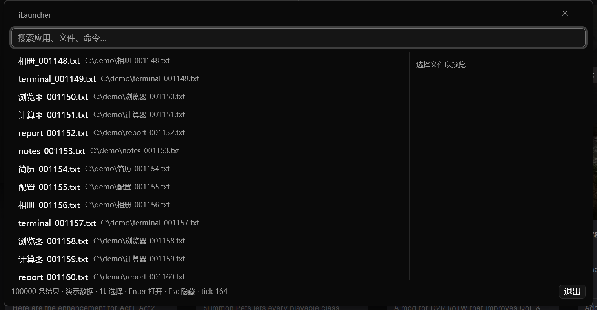 |
| 默认 · 浅 | | 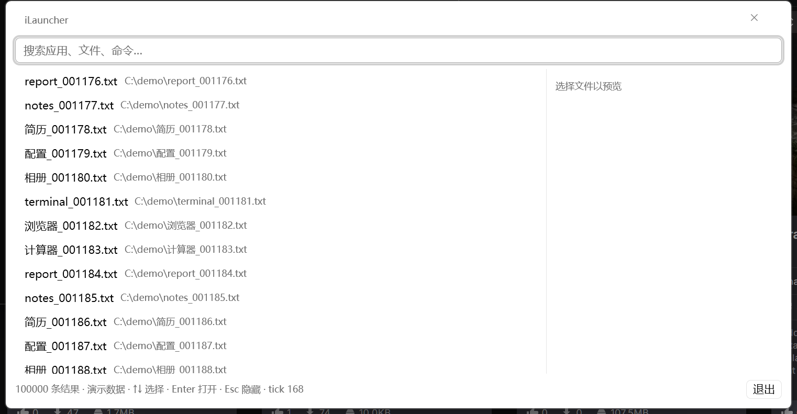 |
| 夜幕 Nord | 冷灰蓝，低对比护眼 | 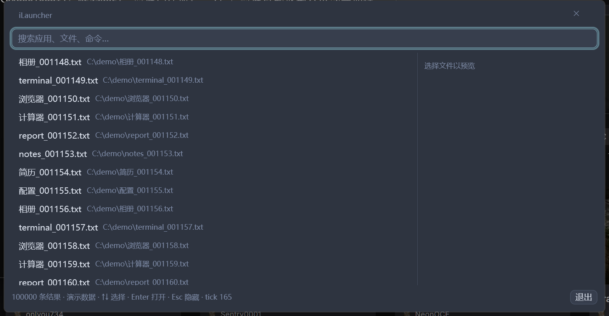 |
| 赛博霓虹 | 深色底 + 荧光青/品红 | 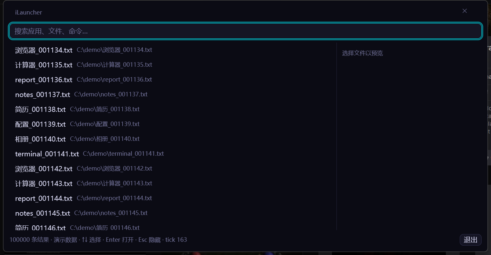 |
| 猫咖摩卡 | 暖棕粉彩，柔和 | 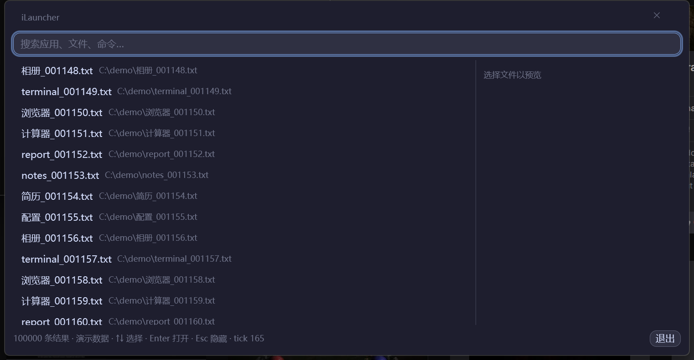 |
| 暖阳米纸 | 米白暖纸，浅色 | 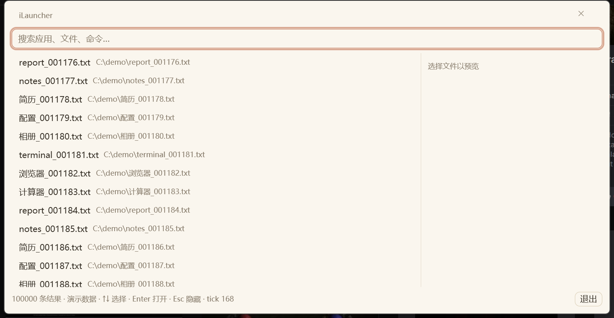 |
| 薄荷雾 | 浅绿灰，清爽 | 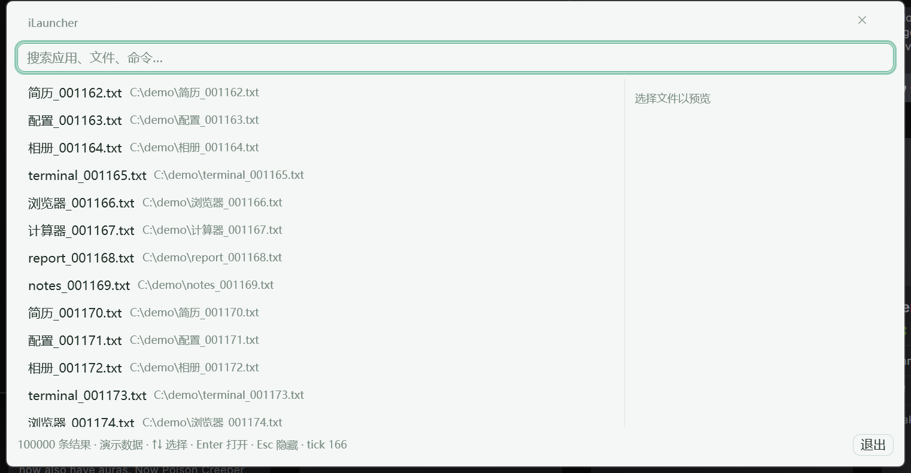 |

## 设计语言

重设计遵循 token 先行、状态与提示分离、空状态即行动邀请的原则。

### 主窗口

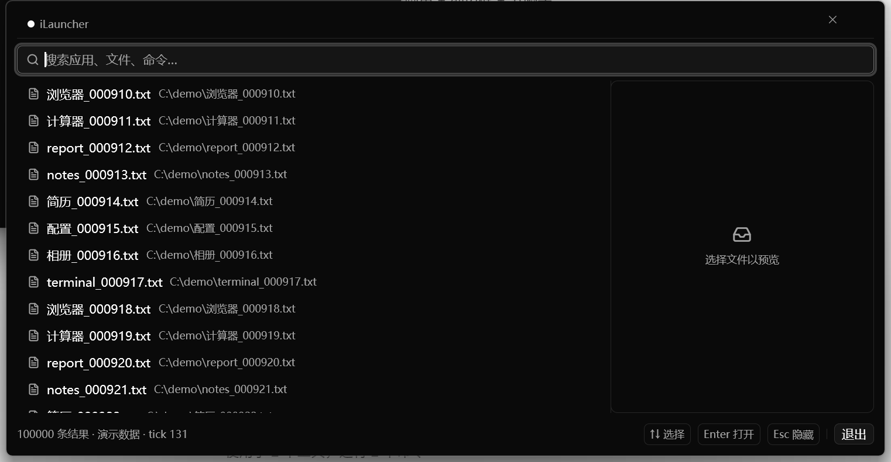

- 搜索框：Search 图标前缀 + 可清除（cleanable）
- 列表行首图标：插件 emoji / 文件 FileText 图标
- 右侧预览卡片：圆角 + 描边 + 分隔头，空态为 Inbox 图标 + 「选择文件以预览」
- 底部状态栏左置：只放状态信息（结果数、运行状态）
- 右侧 kbd 胶囊：按键用「按键形状」呈现，而不是混进一句话里
- 空状态：大 Search 图标 + 「输入关键词，搜索应用、文件与命令」

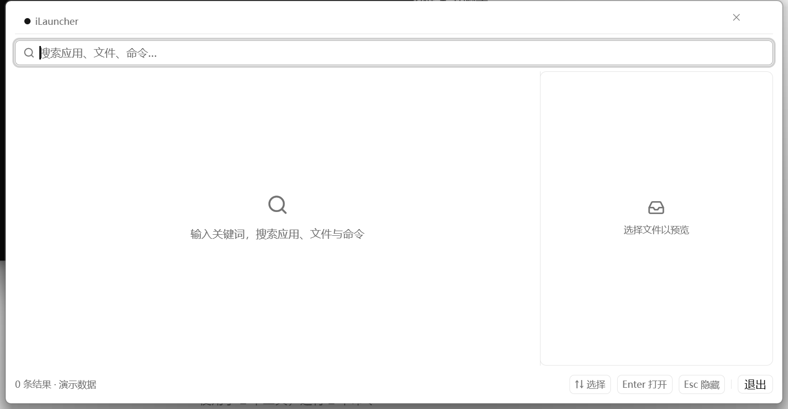

### 副窗口（剪贴板 / 审计 / 插件 / 工作流 / AI）

五个副窗口与主窗口共用同一套语言：

- 输入框统一 Search 图标前缀 + cleanable
- 页脚统一 `justify_between`：左侧状态文字（条目数、提示），右侧 kbd 胶囊
- 次级按钮统一描边（outline）样式

| 窗口 | 预览 |
| --- | --- |
| 剪贴板 | 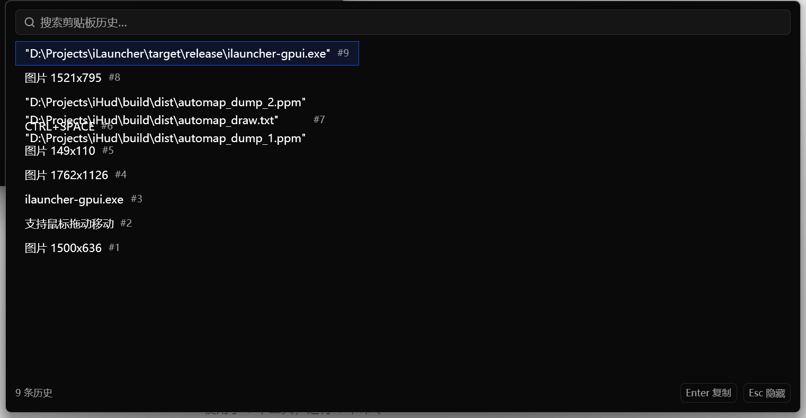 |
| 审计 | 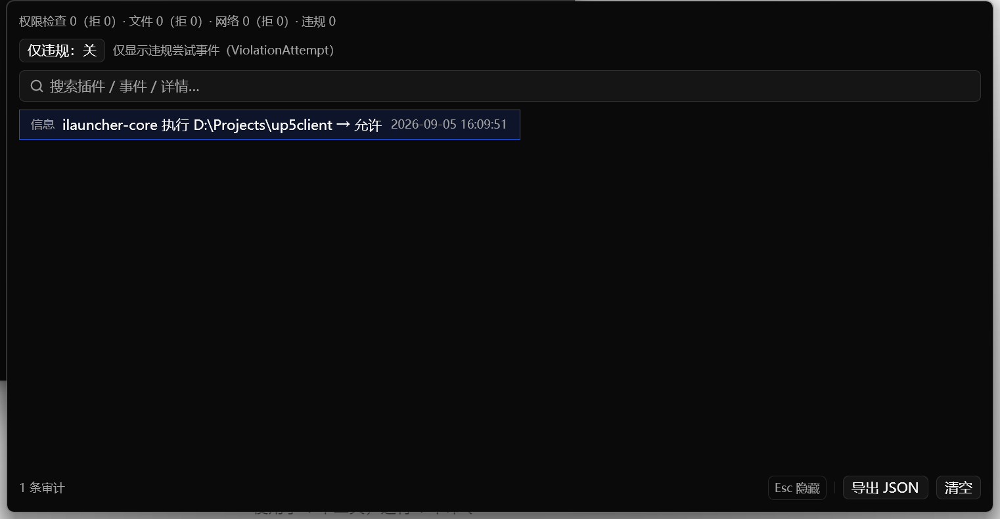 |
| 插件 | 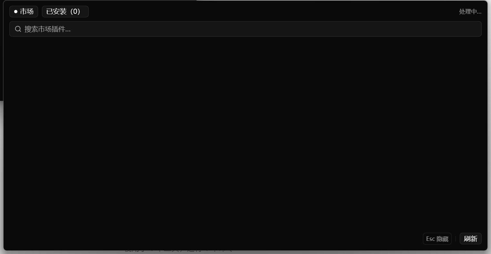 |
| 工作流 | 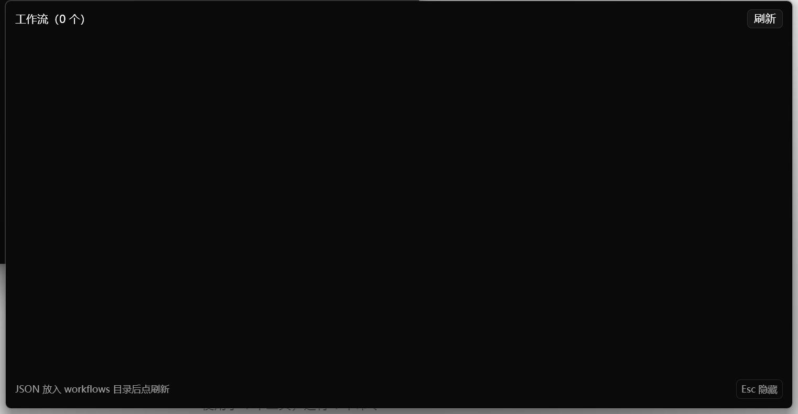 |
| AI 对话 | 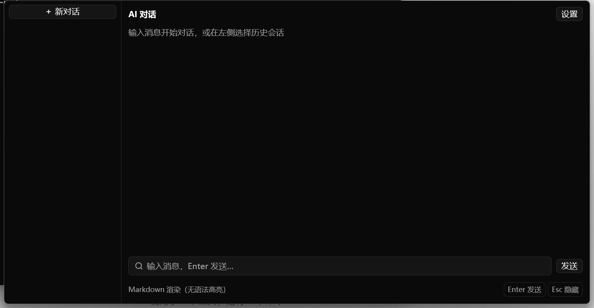 |

## 截图复现

```powershell
# 主窗口（bench 模式滚动 10 万条演示数据）
pwsh -File scripts/capture-skin.ps1 -Skin nord-night -OutPng out.png -Mode bench

# 副窗口（需带特性构建：cargo build -p ilauncher-gpui --features ilauncher,clipboard）
pwsh -File scripts/capture-dev.ps1 -Which clipboard -OutPng out.png
```

> 注：`capture-skin.ps1` 会写注册表 `Skin`/`ThemeMode` 值，跑完记得清理。
